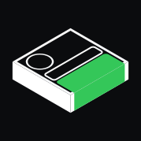

# SwiftUX for Codex



[SwiftUX](https://www.swiftux.app) is a catalog of production SwiftUI components (single views) and flows (multi-screen journeys). This plugin connects Codex to it, so that when you ask for a piece of UI, Codex finds the catalog items that fit, shows them to you as preview cards, and adapts the one you choose to your codebase.

## Install

One line in your terminal adds the marketplace and installs the plugin:

```
codex plugin marketplace add SwiftUX-app/swiftux-codex-plugin && codex plugin add swiftux@swiftux
```

Or add the marketplace with `codex plugin marketplace add SwiftUX-app/swiftux-codex-plugin`, then open `/plugins` in Codex and install **SwiftUX** from there.

Restart Codex, then ask for one piece of UI, for example *"add a paywall with a monthly/yearly toggle"*. `codex mcp list` should show `swiftux` as enabled.

To update later: `codex plugin marketplace upgrade`.

## Claude Code

The same catalog, as a Claude Code plugin. Add the marketplace and install:

```
claude plugin marketplace add SwiftUX-app/swiftux-codex-plugin && claude plugin install swiftux@swiftux
```

Or load it from a checkout for one session: `claude --plugin-dir plugins/swiftux-claude`.

It connects the same MCP server and adds a pane for `show_picks`, built on Claude Code's function hooks (early access): the picks as cards side by side, the next one peeking in at the edge, moved one card at a time with `h` / `l` or `‹` / `›`, like the Codex rail. Each card shows its picture (`image_url`, or `preview_url` when there is none), the name, author and use, a **Use** button (`1`–`6`) that puts the choice in your prompt, and a **View** link to the catalog. `/swiftux-picks` reopens the last picks.

Pictures draw in terminals with the kitty graphics protocol (kitty, Ghostty), as PNG; other terminals and the desktop app show a link in their place. The plugin downloads them with `curl` from `media.swiftux.app`.

## What you get

The SwiftUX MCP server (`https://api.swiftux.app/mcp`), which provides these tools:

- `search_catalog` returns every component or flow that fits the request, best first.
- `show_picks` shows those options as interactive preview cards (an MCP App), with a summary of the request and why they fit.
- `get_component` / `get_flow` and their `*_source` tools let Codex adapt the source you pick.

## Layout

```
.agents/plugins/marketplace.json   the Codex marketplace: one plugin, "swiftux"
plugins/swiftux/
  .codex-plugin/plugin.json        the plugin manifest (name, listing text, logo, brand color)
  .mcp.json                        the SwiftUX MCP server
  assets/logo.svg                  the logo and composer icon
.claude-plugin/marketplace.json    the Claude Code marketplace: one plugin, "swiftux"
plugins/swiftux-claude/
  .claude-plugin/plugin.json       the plugin manifest, with the SwiftUX MCP server
  hooks/register.tsx               the picks pane
  types/index.d.ts                 the pane's state
  tests/picks.test.ts              run with `claude plugin test plugins/swiftux-claude`
```

Releasing: raise `version` in `plugins/swiftux/.codex-plugin/plugin.json` and push. Installed copies pick it up with `codex plugin marketplace upgrade`. For Claude Code, raise `version` in `plugins/swiftux-claude/.claude-plugin/plugin.json`; installed copies pick it up with `claude plugin marketplace update swiftux`.

## Privacy

The plugin sends your UI request (`ux_task`) to the SwiftUX API to search the catalog. It does not read your code to search, and it does not send your code anywhere.
